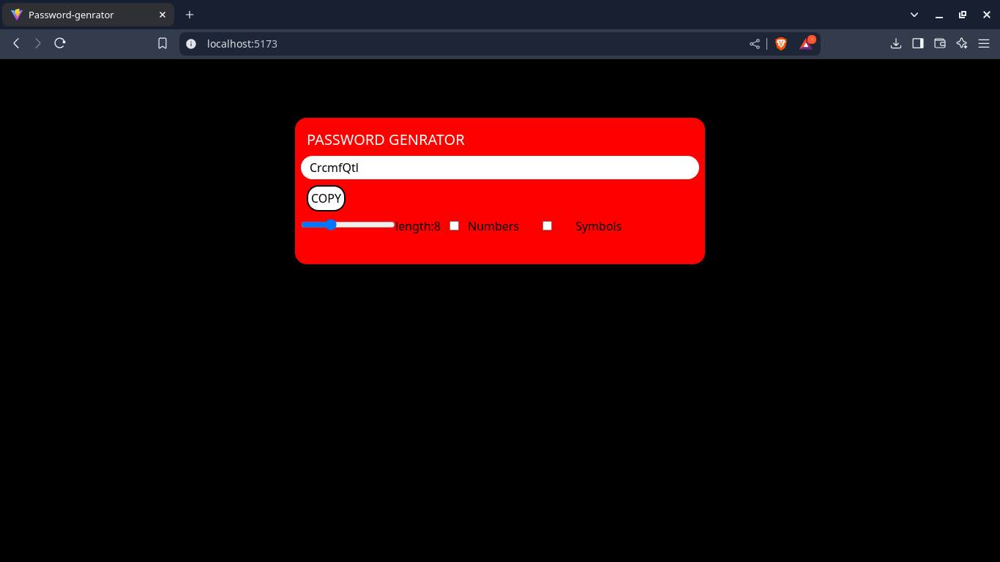

# 🔑 Password Generator

A simple and customizable password generator built with **React** and **Vite**. This tool allows users to generate strong passwords with adjustable length and optional numbers & symbols.

## 🚀 Features
✅ Generate secure passwords instantly  
✅ Adjustable password length using a slider  
✅ Option to include numbers and symbols  
✅ Simple and user-friendly UI  
✅ Copy password to clipboard  

## 🖥️ Tech Stack
- **Frontend:** React, Tailwind CSS  
- **Build Tool:** Vite  

## 📷 Screenshot


## ⚙️ Installation
Follow these steps to run the project locally:

```bash
# Clone the repository
git clone https://github.com/IRFAN-KHAN-git/Password-genrator.git

# Navigate into the project folder
cd Password-genrator

# Install dependencies
npm install

# Start the development server
npm run dev
